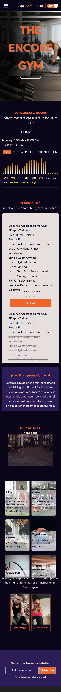

# Luis Guaiquirian

## 📜 MEETPeople project 📜

Responsive website with functional links. Mainly for Sass practice and some Js.

## 👨‍💻 Used Technologies 👨‍💻

| Technology | Description                                                                          |
| ---------- | ------------------------------------------------------------------------------------ |
| HTML       | Basic structure.                                                                     |
| CSS        | Style and animations.                                                                |
| Sass       | To compile all the CSS style, I did use some variables, utilities and mixins from it |
| JavaScript | All the interaction, mainly used in the testimonial section.                         |

## 🤗 Social Network 🤗

- 🧑‍💻 GitHub: https://github.com/luisgcode 🧑‍💻
- 🧑‍💻 LinkedIn: https://www.linkedin.com/in/luisgcode/ 🧑‍💻
- 🧑‍💻 Instagram: https://www.instagram.com/luisgcode/ 🧑‍💻

## 📜 Screenshots 📜

